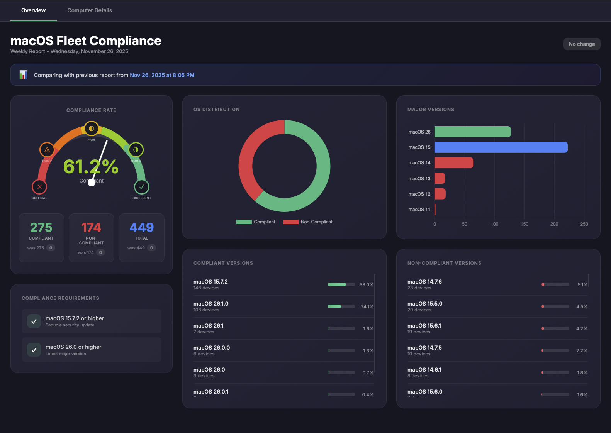

# JAMF macOS Compliance Dashboard

A bash script that collects OS version data from JAMF Pro and generates a beautiful HTML compliance dashboard.

## 📊 Dashboard Preview



## Features

- **Real-time JAMF Pro Integration** - Collects OS version data via JAMF Pro API
- **Beautiful Dark Theme Dashboard** - Modern UI with radial compliance gauge
- **Comparison Tracking** - Shows changes from previous reports (e.g., "+10 compliant")
- **Interactive Computer Details** - Search, filter, and sort all managed devices
- **Export to CSV** - Download compliance data for further analysis
- **Automatic Browser Launch** - Opens dashboard immediately after generation

## Compliance Requirements

The script considers a device **compliant** if it meets either:
- macOS 15.7.2 or higher (Sequoia security update)
- macOS 26.0 or higher (Latest major version)

## Installation

1. Clone this repository:
   ```bash
   git clone https://github.com/YOUR_USERNAME/jamf-compliance-dashboard.git
   cd jamf-compliance-dashboard
   ```

2. Make the script executable:
   ```bash
   chmod +x jamf_collect_os_versions.sh
   ```

3. Edit the script to add your JAMF Pro credentials (optional - can also enter at runtime):
   ```bash
   JAMF_URL="https://yourcompany.jamfcloud.com"
   JAMF_CLIENT_ID="your-client-id"
   JAMF_CLIENT_SECRET="your-client-secret"
   ```

## Usage

```bash
./jamf_collect_os_versions.sh
```

The script will:
1. Authenticate with JAMF Pro API
2. Collect OS version data for all computers
3. Generate a CSV report
4. Generate an HTML dashboard
5. Open the dashboard in your default browser

## Output Files

Files are saved to `~/Downloads/Reports/`:
- `jamf_os_report_YYYYMMDD_HHMMSS.csv` - Raw data
- `jamf_os_dashboard_YYYYMMDD_HHMMSS.html` - Interactive dashboard

## Weekly Automation (macOS)

To run automatically every Monday at 9am, create a LaunchAgent:

```bash
cat > ~/Library/LaunchAgents/com.jamf.oscompliance.plist << 'EOF'
<?xml version="1.0" encoding="UTF-8"?>
<!DOCTYPE plist PUBLIC "-//Apple//DTD PLIST 1.0//EN" "http://www.apple.com/DTDs/PropertyList-1.0.dtd">
<plist version="1.0">
<dict>
    <key>Label</key>
    <string>com.jamf.oscompliance</string>
    <key>ProgramArguments</key>
    <array>
        <string>/path/to/jamf_collect_os_versions.sh</string>
    </array>
    <key>StartCalendarInterval</key>
    <dict>
        <key>Weekday</key>
        <integer>1</integer>
        <key>Hour</key>
        <integer>9</integer>
    </dict>
</dict>
</plist>
EOF

launchctl load ~/Library/LaunchAgents/com.jamf.oscompliance.plist
```

## JAMF Pro API Requirements

Create an API Client in JAMF Pro with the following permissions:
- **Read Computers** access

## License

MIT License - Feel free to use and modify as needed.
