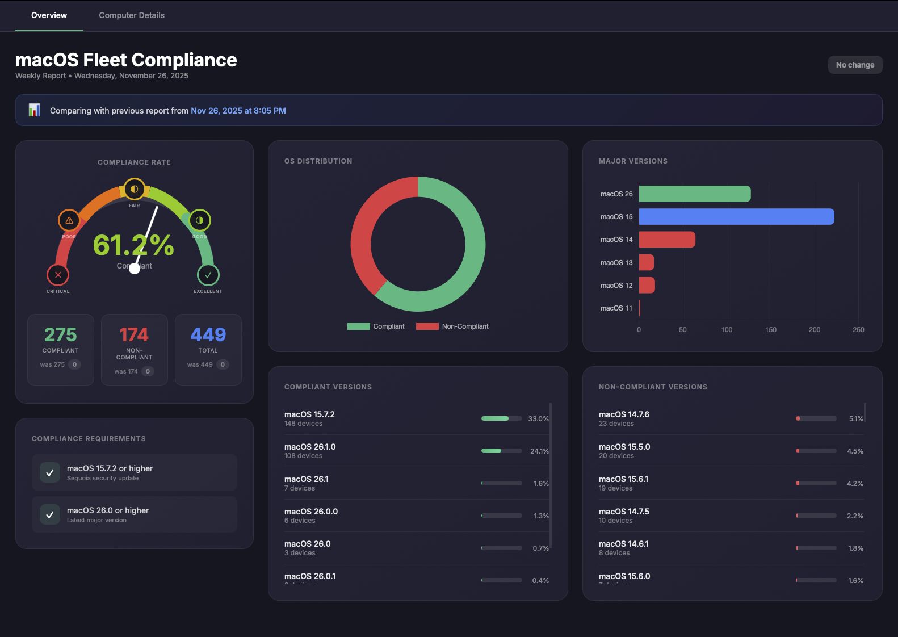

# JAMF macOS Compliance Dashboard

A privacy-conscious Bash utility that retrieves computer inventory from JAMF Pro and creates CSV and interactive HTML compliance reports.



## What it provides

- JAMF Pro OAuth client-credential authentication
- Paginated inventory collection with retries and partial-report protection
- macOS compliance totals, version distribution, and comparison with the previous report
- Searchable and sortable computer details
- Correctly escaped CSV export
- Explicit **Unknown** handling for devices without an OS version

## Requirements

- macOS or another Unix-like system
- Bash, `curl`, and Python 3
- A JAMF Pro API Client with the minimum read-only computer inventory privilege required by your JAMF version

## Installation

```bash
git clone https://github.com/sebastiansantos1986/jamf-compliance-dashboard.git
cd jamf-compliance-dashboard
chmod +x jamf_collect_os_versions.sh
```

## Usage

The safest interactive mode prompts for the client secret without echoing it:

```bash
./jamf_collect_os_versions.sh
```

For unattended execution, supply configuration through the process environment or a secrets manager. Never commit credentials:

```bash
JAMF_URL="https://example.jamfcloud.com" \
JAMF_CLIENT_ID="your-client-id" \
JAMF_CLIENT_SECRET="read-from-your-secret-manager" \
AUTO_OPEN_BROWSER=false \
./jamf_collect_os_versions.sh
```

Optional settings:

| Variable | Default | Purpose |
| --- | --- | --- |
| `OUTPUT_DIR` | `$HOME/Downloads/Reports` | Private report directory |
| `AUTO_OPEN_BROWSER` | `true` | Open the generated HTML report on macOS |
| `PAGE_SIZE` | `100` | JAMF inventory records requested per page |
| `CURL_TIMEOUT` | `60` | Per-request timeout in seconds |

Reports are written with owner-only permissions. They contain usernames, serial numbers, and device inventory data; store and share them according to your organization’s privacy policy.

## Compliance policy

A device is currently compliant when it runs either:

- macOS 15.7.2 or newer within macOS 15
- macOS 26.0 or newer

Devices with missing or malformed OS versions are included as non-compliant/unknown instead of being omitted from the denominator. Update both the Python and JavaScript policy checks together when your organization changes its baseline.

## Validation

```bash
bash -n jamf_collect_os_versions.sh
shellcheck jamf_collect_os_versions.sh
python3 -m unittest discover -s tests -v
```

GitHub Actions runs these checks on pushes and pull requests.

## Security notes

- Credentials are never stored in this repository.
- JAMF-originated values are escaped before browser rendering.
- API calls fail on HTTP errors, retry transient failures, and refuse incomplete inventories.
- Chart.js is version-pinned, but the HTML report still loads it from jsDelivr. For fully offline environments, vendor that file internally.

## License

MIT — see [LICENSE](LICENSE).
